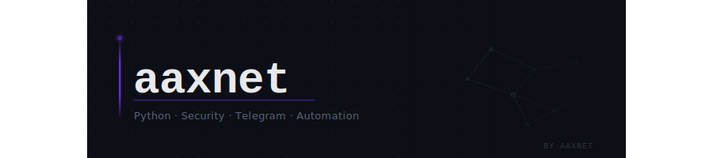

  

 

  
  &nbsp;
  
  &nbsp;
  
  &nbsp;
  

 

  Full-stack engineer focused on backend architecture, security research, and developer tooling. 
  I build things that are fast, reliable, and minimal by design.

---

**languages**

  

 

**backend & infra**

  

 

**tools & platforms**

  

---

**selected projects**

| project | stack | description |
|---------|-------|-------------|
| [**vk_api**](https://github.com/aaxnet/vk_api) | `Python` | VKontakte API wrapper for building VK scripts and bots |
| [**issuesheriff**](https://github.com/aaxnet/issuesheriff) | `Python` | AI-powered GitHub issue triage — labels, dedup, auto-reply via CLI or Action |
| [**discord-quest-master**](https://github.com/aaxnet/discord-quest-master) | `JavaScript` | Auto-complete Discord quests · bilingual RU/EN · browser & desktop |

---

**stats**

  
  &nbsp;
  

  

---

  minimal · precise · built to last

